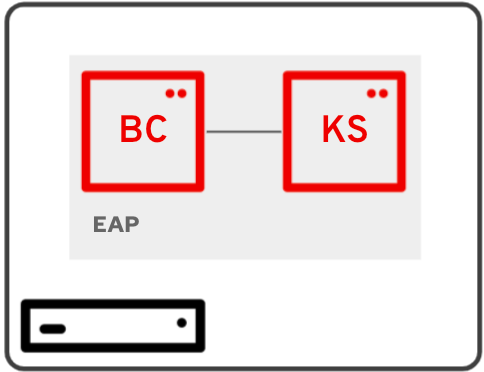
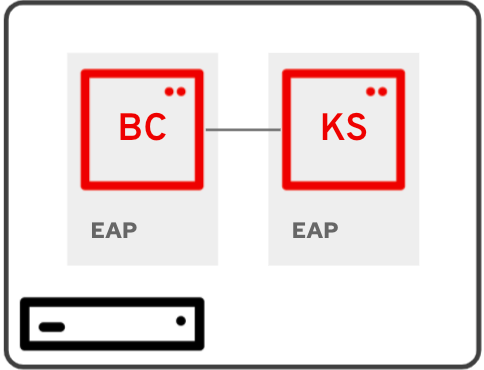

# RHPAM-7.11 Sandbox Installation

## Installation packages

- Download and copy [installation packages](installs/README.md) to ./installs folder

## BC + KS on same EAP



### Run RHPAM installation script

```
$ ./1-install.sh
```

### Configure RHPAM

- Start EAP Server in admin mode

```
$ cd ../rhpam-7.11/bin
$ ./standalone.sh -c standalone-full.xml --admin-only
```

- In another terminal, run the system properties configuration script

```
$ ./2-add-props.sh
```

- Then, run the kie server configuration script

```
$ ./3-add-kieserver-props.sh
```

- Optionally, you can configure the persistance.

- Stop EAP Server (admin mode)

### Start RHPAM

```
$ cd ../rhpam-7.11
$ ./bin/standalone.sh -c standalone-full.xml
```

## BC + KS on separate EAPs



### Run RHPAM BC installation script

```
$ ./1-install-bc.sh
```

### Configure RHPAM BC

- Start EAP Server in admin mode

```
$ cd ../rhpam-bc-7.11/bin
$ ./standalone.sh -c standalone-full.xml --admin-only
```

- In another terminal, run the system properties configuration script

```
$ ./2-add-props-bc.sh
```

### Run RHPAM KS installation script

```
$ ./1-install-ks.sh
```

### Configure RHPAM KS

- Start EAP Server in admin mode

```
$ cd ../rhpam-ks-7.11/bin
$ ./standalone.sh -c standalone-full.xml --admin-only
```

- In another terminal, run the system properties configuration script

```
$ ./2-add-props-ks.sh
```

- Optionally, you can configure the persistance.

- Stop EAP Server (admin mode)

### Start RHPAM BC

```
$ cd ../rhpam-bc-7.11
$ ./bin/standalone.sh -c standalone-full.xml
```

### Start RHPAM KS

```
$ cd ../rhpam-ks-7.11
$ ./bin/standalone.sh -c standalone-full.xml -Djboss.socket.binding.port-offset=100
```
